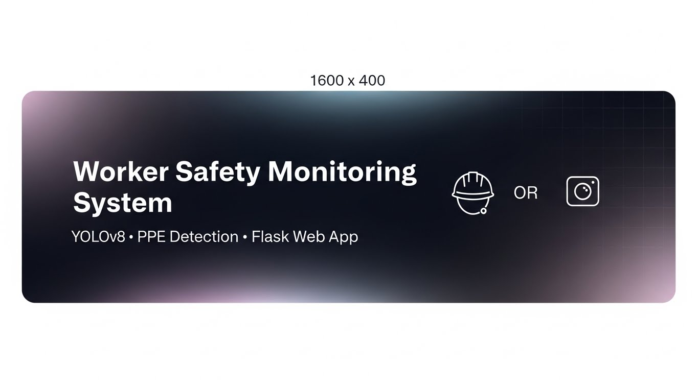

<p align="center">
  
</p>

<div align="center">

  <h1>WORKER SAFETY MONITORING SYSTEM</h1>
  <h3>(worker-safety-yolo)</h3>
  
  <p>
    <b>Transform Safety Monitoring with AI-Driven Precision</b>
  </p>

  <p>
    
    
    
    
    
    
  </p>

  <br />
</div>

---

## 📑 Table of Contents

- [📖 Overview](#-overview)
- [✨ Key Features](#-key-features)
- [🛠️ Tech Stack](#-tech-stack)
- [🏗️ Project Architecture](#-project-architecture)
- [📂 Project Structure](#-project-structure)
- [🚀 Installation](#-installation)
- [💡 Usage](#-usage)
- [🧠 Model & Detected Classes](#-model--detected-classes)
- [🔮 Future Improvements](#-future-improvements)
- [📄 License](#-license)
- [🤝 Acknowledgements](#-acknowledgements)

---

## 📖 Overview

**Worker Safety Monitoring System** is a cutting-edge AI application designed to enhance safety standards on construction sites. By leveraging the power of computer vision and deep learning, this system automatically analyzes video footage to detect Personal Protective Equipment (PPE) compliance in real-time.

Using a fine-tuned **YOLOv8** model, the system identifies workers, safety gear, and potential hazards. It provides immediate visual feedback, highlighting violations such as missing hardhats or safety vests with distinct alerts, ensuring a safer working environment.

---

## ✨ Key Features

* **🎥 Seamless Video Upload:** User-friendly web interface allows for easy uploading of recorded CCTV or site footage directly from the browser.
* **🤖 Advanced AI Inference:** Powered by **YOLOv8**, ensuring high-speed and accurate detection of safety elements.
* **🚨 Violation Alerts:** Automatically highlights safety violations (e.g., missing helmet) in **RED** and displays a blinking "VIOLATION DETECTED" warning.
* **✅ Intelligent Color Coding:** Compliant detections (wearing PPE) are shown in standard neutral colors, while violations stand out immediately.
* **📹 Recorded Video Support:** Optimized for processing pre-recorded videos, eliminating the need for live camera feeds during analysis.
* **🎨 Modern Premium UI:** A dark-themed, responsive interface built with HTML, CSS, and JS for a professional user experience.

---

## 🛠️ Tech Stack

| Component | Technology | Description |
| :--- | :--- | :--- |
| **Model** |  | Fine-tuned `best.pt` for object detection |
| **Backend** |  | Python web framework for handling requests |
| **Processing** |  | Video frame manipulation and drawing |
| **Frontend** |  | Responsive and interactive user interface |

---

## 🏗️ Project Architecture

The system follows a streamlined pipeline to process video data:

1.  **Input:** User uploads a video file via the Flask web interface.
2.  **Preprocessing:** OpenCV reads the video frame-by-frame.
3.  **Inference:** Each frame is passed to the YOLOv8 model (`best.pt`).
4.  **Logic:** The system checks class IDs. If a "NO-Hardhat" or "NO-Mask" class is detected, a violation flag is raised.
5.  **Annotation:** Bounding boxes are drawn (Red for violations, Green/Blue for safe). Text alerts are overlaid.
6.  **Output:** Processed frames are streamed back to the user's browser.

---

## 📂 Project Structure

```bash
worker-safety-yolo/
├── app.py                # Main Flask application
├── requirements.txt      # Python dependencies
├── weights/
│   └── best.pt           # Fine-tuned YOLOv8 model
├── static/
│   ├── css/
│   │   └── style.css     # Modern styling
│   ├── js/
│   │   └── script.js     # Frontend logic
│   └── uploads/          # Temp folder for uploaded videos
├── templates/
│   └── index.html        # Main dashboard interface
├── README.md             # Project documentation
└── .gitignore            # Git ignore file
